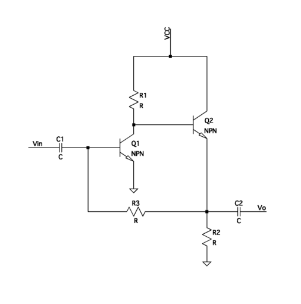
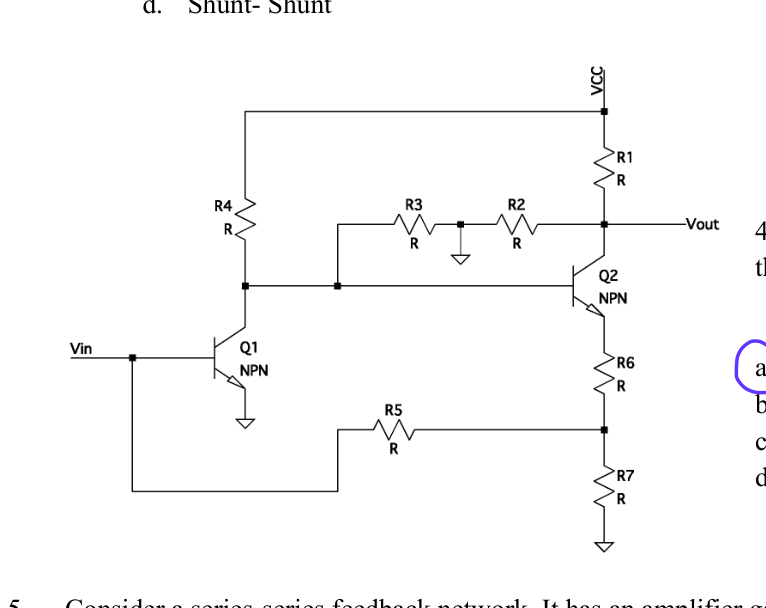
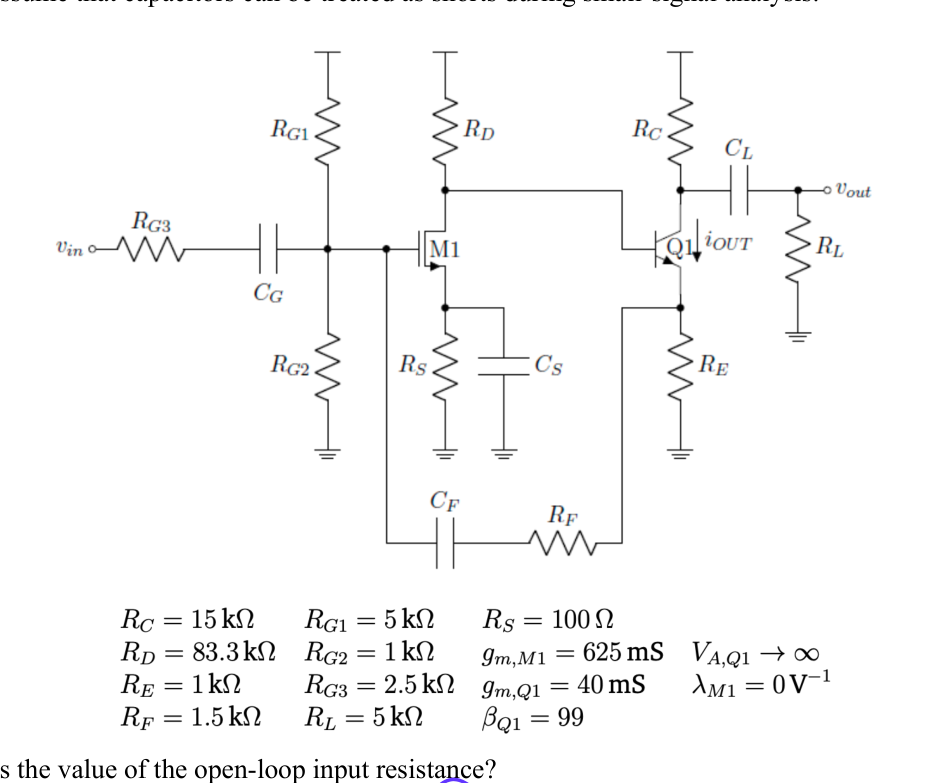
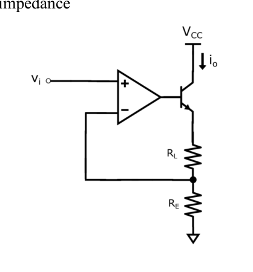
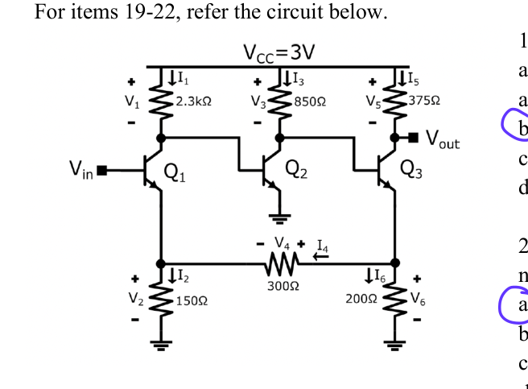
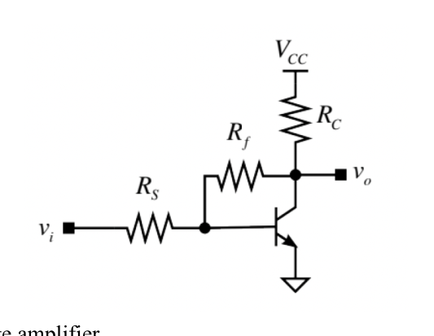
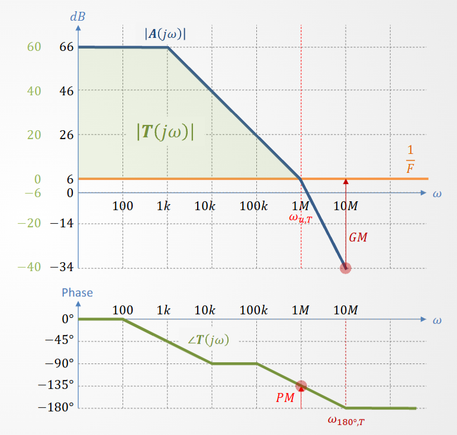
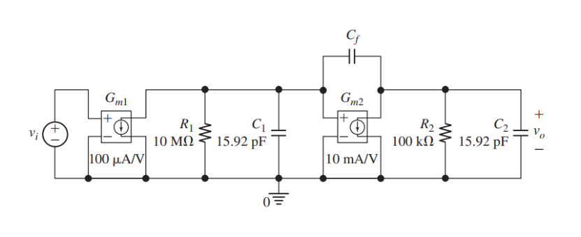

# Part 1 · Feedback Gain & Basic Effects {.center}


## Q1

If an amplifier has a forward gain of 400 and the feedback ratio is 0.1, find the overall gain with negative feedback.

```{=html}
<ul class="answer-list">
  <li class="fragment semi-fade-out" data-fragment-index="1">A. 6.75</li>
  <li class="fragment semi-fade-out" data-fragment-index="1">B. 7.75</li>
  <li class="correct-answer fragment" data-fragment-index="1">C. 9.75</li>
  <li class="fragment semi-fade-out" data-fragment-index="1">D. 10.75</li>
</ul>
```


## Q2

A shunt-series feedback amplifier has a voltage gain with feedback of 83.33 and feedback factor of 0.01. What is the voltage gain without feedback?

```{=html}
<ul class="answer-list">
  <li class="fragment semi-fade-out" data-fragment-index="1">A. 200</li>
  <li class="fragment semi-fade-out" data-fragment-index="1">B. 300</li>
  <li class="fragment semi-fade-out" data-fragment-index="1">C. 400</li>
  <li class="correct-answer fragment" data-fragment-index="1">D. 500</li>
</ul>
```


## Q7

The negative feedback in an amplifier leads to which one of the following?

```{=html}
<ul class="answer-list">
  <li class="fragment semi-fade-out" data-fragment-index="1">A. Increase in current gain</li>
  <li class="fragment semi-fade-out" data-fragment-index="1">B. Increase in voltage gain</li>
  <li class="correct-answer fragment" data-fragment-index="1">C. Decrease in voltage gain</li>
  <li class="fragment semi-fade-out" data-fragment-index="1">D. Decreases in bandwidth</li>
</ul>
```


## Closed-Loop Gain & Feedback Effects {.smaller}

<!-- CAPACITY: ✓ ~11 lines -->

:::: {.columns}

::: {.column width="47%"}

$$\text{Loop gain: } T = AF$$

$$
A_{CL} = \frac{A}{1+T}
$$
$$
\text{With large gain } A:
\quad
A_{CL} \approx \frac{1}{F}
$$

**Impedance:**

- series connection at a port $\rightarrow R$ **increases** by $(1+T)$
- shunt connection $\rightarrow R$ **decreases** by $(1+T)$

:::

::: {.column width="47%"}

| Property | Change | Scale factor |
|---|---|---|
| Gain | ↓ | $\div(1+T)$ |
| Bandwidth | ↑ | $\times(1+T)$ |
| GBW product | constant | — |
| Distortion / Nonlinearity | ↓ | $\div(1+T)$ |

:::

::::

# Part 2 · Topology Classification & Amplifier Types {.center}


## Q3

:::: {.columns}

::: {.column width="46%"}
{width=100% fig-alt="Circuit diagram for Q3"}
:::

::: {.column width="54%"}
What is the feedback configuration of the circuit on the right?

```{=html}
<ul class="answer-list">
  <li class="fragment semi-fade-out" data-fragment-index="1">A. Shunt-Series</li>
  <li class="fragment semi-fade-out" data-fragment-index="1">B. Series-Series</li>
  <li class="correct-answer fragment" data-fragment-index="1">C. Series-Shunt</li>
  <li class="fragment semi-fade-out" data-fragment-index="1">D. Shunt-Shunt</li>
</ul>
```
:::

::::


## Q4

:::: {.columns}

::: {.column width="46%"}
{width=100% fig-alt="Circuit diagram for Q4"}
:::

::: {.column width="54%"}
What feedback circuits are present in the circuit on the left?

```{=html}
<ul class="answer-list">
  <li class="correct-answer fragment" data-fragment-index="1">A. shunt-shunt and shunt-series</li>
  <li class="fragment semi-fade-out" data-fragment-index="1">B. shunt-shunt only</li>
  <li class="fragment semi-fade-out" data-fragment-index="1">C. shunt-series only</li>
  <li class="fragment semi-fade-out" data-fragment-index="1">D. shunt-shunt and series-series</li>
</ul>
```
:::

::::


## Q6

What happens to the impedances of an amplifier where the feedback is connected **in parallel with the output** and **in series with the input**? *(Select all that apply.)*

```{=html}
<ul class="answer-list">
  <li class="correct-answer fragment" data-fragment-index="1">A. Its input impedance increases</li>
  <li class="fragment semi-fade-out" data-fragment-index="1">B. Its output impedance increases</li>
  <li class="correct-answer fragment" data-fragment-index="1">C. Its output impedance decreases</li>
  <li class="fragment semi-fade-out" data-fragment-index="1">D. Its input impedance decreases</li>
</ul>
```


## Q13

Which of the following best describes the signal and feedback type in a shunt-shunt feedback amplifier?

```{=html}
<ul class="answer-list">
  <li class="fragment semi-fade-out" data-fragment-index="1">A. Voltage input, voltage feedback</li>
  <li class="fragment semi-fade-out" data-fragment-index="1">B. Current input, voltage feedback</li>
  <li class="fragment semi-fade-out" data-fragment-index="1">C. Voltage input, current feedback</li>
  <li class="correct-answer fragment" data-fragment-index="1">D. Current input, current feedback</li>
</ul>
```


## Q14

Identify the amplifier property that is applicable to a current amplifier.

```{=html}
<ul class="answer-list">
  <li class="fragment semi-fade-out" data-fragment-index="1">A. High input impedance</li>
  <li class="fragment semi-fade-out" data-fragment-index="1">B. High efficiency</li>
  <li class="correct-answer fragment" data-fragment-index="1">C. Low input impedance</li>
  <li class="fragment semi-fade-out" data-fragment-index="1">D. Low output impedance</li>
</ul>
```


## Q15

A shunt-series topology is a ______ amplifier with feedback.

```{=html}
<ul class="answer-list">
  <li class="correct-answer fragment" data-fragment-index="1">A. current</li>
  <li class="fragment semi-fade-out" data-fragment-index="1">B. transconductance</li>
  <li class="fragment semi-fade-out" data-fragment-index="1">C. voltage</li>
  <li class="fragment semi-fade-out" data-fragment-index="1">D. transresistance</li>
</ul>
```


## Q16

A transconductance amplifier should have:

```{=html}
<ul class="answer-list">
  <li class="fragment semi-fade-out" data-fragment-index="1">A. Low output impedance</li>
  <li class="fragment semi-fade-out" data-fragment-index="1">B. High efficiency</li>
  <li class="fragment semi-fade-out" data-fragment-index="1">C. Low input impedance</li>
  <li class="correct-answer fragment" data-fragment-index="1">D. High output impedance</li>
</ul>
```


## Review — The Four Feedback Topologies {.smaller}

<!-- CAPACITY: ✓ ~10 lines -->

**Series** = feedback subtracts a **voltage** (KVL). &ensp; **Shunt** = subtracts a **current** (KCL).

| Topology | $R_{in}$ | $R_{out}$ | Amplifier type |
|---|---|---|---|
| Series-Series | $\times(1+T)$ | $\times(1+T)$ | Transconductance $G_m$ |
| Series-Shunt | $\times(1+T)$ | $\div(1+T)$ | Voltage $A_v$ |
| Shunt-Series | $\div(1+T)$ | $\times(1+T)$ | Current $A_i$ |
| Shunt-Shunt | $\div(1+T)$ | $\div(1+T)$ | Transresistance $R_m$ |


**Impedance:**

- series connection at a port $\rightarrow R$ **increases** by $(1+T)$
- shunt connection $\rightarrow R$ **decreases** by $(1+T)$


## Review — Amplifier Types {.smaller}

<!-- CAPACITY: ✓ ~11 lines -->

| Type | Ideal $R_{in}$ | Ideal $R_{out}$ | Input | Output |
|---|---|---|---|---|
| Voltage $A_v$ | $\infty$ | $0$ | V | V |
| Current $A_i$ | $0$ | $\infty$ | I | I |
| Transconductance $G_m$ | $\infty$ | $\infty$ | V | I |
| Transresistance $R_m$ | $0$ | $0$ | I | V |

Feedback pushes toward ideal: series port → $R\uparrow\to\infty$; shunt port → $R\downarrow\to 0$.

**Hook:** *First word = input connection; second = output.* Shunt-Series = current amp ✓ (Q15).


# Part 3 · Circuit Feedback Analysis {.center}

## Q5

Consider a series-series feedback network: amplifier gain = 100, feedback factor = 5, input voltage = 4 V, input current = 2 mA. Find the input resistance of the network.

```{=html}
<ul class="answer-list">
  <li class="correct-answer fragment" data-fragment-index="1">A. 1002 kΩ</li>
  <li class="fragment semi-fade-out" data-fragment-index="1">B. 2 kΩ</li>
  <li class="fragment semi-fade-out" data-fragment-index="1">C. 1.002 kΩ</li>
  <li class="fragment semi-fade-out" data-fragment-index="1">D. 2000 kΩ</li>
</ul>
```


## Q8

:::: {.columns}

::: {.column width="46%"}
{width=100% fig-alt="Circuit diagram for Q8"}
:::

::: {.column width="54%"}
What is the value of the open-loop input resistance?

```{=html}
<ul class="answer-list">
  <li class="fragment semi-fade-out" data-fragment-index="1">A. 300 Ω</li>
  <li class="fragment semi-fade-out" data-fragment-index="1">B. 400 Ω</li>
  <li class="correct-answer fragment" data-fragment-index="1">C. 500 Ω</li>
  <li class="fragment semi-fade-out" data-fragment-index="1">D. 600 Ω</li>
</ul>
```
:::

::::


## Q9

:::: {.columns}

::: {.column width="46%"}
{width=100% fig-alt="Circuit diagram for Q9"}
:::

::: {.column width="54%"}
What is the value of the open-loop transconductance?

```{=html}
<ul class="answer-list">
  <li class="fragment semi-fade-out" data-fragment-index="1">A. −33.7 S</li>
  <li class="correct-answer fragment" data-fragment-index="1">B. −35.7 S</li>
  <li class="fragment semi-fade-out" data-fragment-index="1">C. −37.7 S</li>
  <li class="fragment semi-fade-out" data-fragment-index="1">D. −39.7 S</li>
</ul>
```
:::

::::


## Q10

:::: {.columns}

::: {.column width="46%"}
{width=100% fig-alt="Circuit diagram for Q10"}
:::

::: {.column width="54%"}
Determine the value of the feedback factor.

```{=html}
<ul class="answer-list">
  <li class="fragment semi-fade-out" data-fragment-index="1">A. −0.1</li>
  <li class="fragment semi-fade-out" data-fragment-index="1">B. −0.2</li>
  <li class="fragment semi-fade-out" data-fragment-index="1">C. −0.3</li>
  <li class="correct-answer fragment" data-fragment-index="1">D. −0.4</li>
</ul>
```
:::

::::


## Q11

:::: {.columns}

::: {.column width="46%"}
{width=100% fig-alt="Circuit diagram for Q11"}
:::

::: {.column width="54%"}
What is the value of the open-loop gain?

```{=html}
<ul class="answer-list">
  <li class="fragment semi-fade-out" data-fragment-index="1">A. 17,850</li>
  <li class="correct-answer fragment" data-fragment-index="1">B. −17,850</li>
  <li class="fragment semi-fade-out" data-fragment-index="1">C. 15,320</li>
  <li class="fragment semi-fade-out" data-fragment-index="1">D. −15,320</li>
</ul>
```
:::

::::


## Q12

:::: {.columns}

::: {.column width="46%"}
{width=100% fig-alt="Circuit diagram for Q12"}
:::

::: {.column width="54%"}
What is the value of the closed-loop gain?

```{=html}
<ul class="answer-list">
  <li class="fragment semi-fade-out" data-fragment-index="1">A. −1.3998</li>
  <li class="fragment semi-fade-out" data-fragment-index="1">B. 1.3998</li>
  <li class="fragment semi-fade-out" data-fragment-index="1">C. 2.4997</li>
  <li class="correct-answer fragment" data-fragment-index="1">D. −2.4997</li>
</ul>
```
:::

::::


## Q17 $R_L = 1000\ \Omega$, $R_E = 2500\ \Omega$.

:::: {.columns}

::: {.column width="46%"}
{width=100% fig-alt="Circuit diagram for Q17"}
:::

::: {.column width="54%"}
The circuit shown is an example of what type of amplifier?

```{=html}
<ul class="answer-list">
  <li class="correct-answer fragment" data-fragment-index="1">A. Series–Series</li>
  <li class="fragment semi-fade-out" data-fragment-index="1">B. Shunt–Series</li>
  <li class="fragment semi-fade-out" data-fragment-index="1">C. Shunt–Shunt</li>
  <li class="fragment semi-fade-out" data-fragment-index="1">D. Series–Shunt</li>
</ul>
```
:::

::::


## Q18 $R_L = 1000\ \Omega$, $R_E = 2500\ \Omega$.

:::: {.columns}

::: {.column width="46%"}
{width=100% fig-alt="Circuit diagram for Q18"}
:::

::: {.column width="54%"}
Determine the feedback factor F for the circuit.

```{=html}
<ul class="answer-list">
  <li class="correct-answer fragment" data-fragment-index="1">A. 2500 Ω</li>
  <li class="fragment semi-fade-out" data-fragment-index="1">B. 1000 Ω</li>
  <li class="fragment semi-fade-out" data-fragment-index="1">C. 3500 Ω</li>
  <li class="fragment semi-fade-out" data-fragment-index="1">D. 714 Ω</li>
</ul>
```
:::

::::

## Review - Identifying Feedback Topology {.smaller}

<!-- CAPACITY: ✓ ~11 lines -->

:::: {.columns}

::: {.column width="50%"}

**1. Output port — how does the network *sense* the output?**

- Feedback connected **in parallel with $v_o$** → **Shunt** output — senses voltage
- Feedback connected **in series** with the output current path → **Series** output — senses current

**2. Input port — how does the feedback signal *mix*?**

- Feedback appears in **KVL**: $v_{in} = v_s - v_f$ → **Series** input
- Feedback appears in **KCL**: $i_{in} = i_s - i_f$ → **Shunt** input

:::

::: {.column width="50%"}

*Topology name: first word = input port; second = output port.*

| Topology | Senses | Mixes | Type |
|---|---|---|---|
| Series-Shunt | $v_o$ ∥ | $v_f$ KVL | $A_v$ |
| Series-Series | $i_o$ series | $v_f$ KVL | $G_m$ |
| Shunt-Shunt | $v_o$ ∥ | $i_f$ KCL | $R_m$ |
| Shunt-Series | $i_o$ series | $i_f$ KCL | $A_i$ |

:::

::::


## Review — Feedback Analysis Procedure {.smaller}

<!-- CAPACITY: ✓ ~10 lines -->

- Identify the feedback topology and the feedback network.
- Obtain the two-port parameters of the feedback network: $R_{i,fb}$, $R_{o,fb}$, $f$.
    - When finding $R_{i,fb}$, if the output port is shunt, **short** the output; if series, **open** the output.
    - When finding $R_{o,fb}$, if the input port is shunt, **short** the input; if series, **open** the input.
    - $f$ is obtained via Thevenin/Norton principles.
- Find the open-loop gain $A$ of the forward path (with $f=0$, but including $R_{i,fb}$ and $R_{o,fb}$).
- Use the formulas to obtain the overall two-port:
    - $R_{in} = R_{i,fb} \times (1+AF)$ if series input, $R_{i,fb} / (1+AF)$ if shunt input.
    - $R_{out} = R_{o,fb} \times (1+AF)$ if series output, $R_{o,fb} / (1+AF)$ if shunt output.
    - $A_{CL} = A / (1 + AF)$.

# Part 4 · Shunt-Input Feedback Analysis {.center}


## Q19

:::: {.columns}

::: {.column width="46%"}
{width=100% fig-alt="Circuit diagram for Q19"}
:::

::: {.column width="54%"}
The circuit is an example of what type of amplifier?

```{=html}
<ul class="answer-list">
  <li class="fragment semi-fade-out" data-fragment-index="1">A. Series–Series</li>
  <li class="correct-answer fragment" data-fragment-index="1">B. Shunt–Series</li>
  <li class="fragment semi-fade-out" data-fragment-index="1">C. Shunt–Shunt</li>
  <li class="fragment semi-fade-out" data-fragment-index="1">D. Series–Shunt</li>
</ul>
```
:::

::::


## Q20

:::: {.columns}

::: {.column width="46%"}
{width=100% fig-alt="Circuit diagram for Q20"}
:::

::: {.column width="54%"}
What is the input resistance of the feedback network in this circuit?

```{=html}
<ul class="answer-list">
  <li class="correct-answer fragment" data-fragment-index="1">A. 138.46 Ω</li>
  <li class="fragment semi-fade-out" data-fragment-index="1">B. 500 Ω</li>
  <li class="fragment semi-fade-out" data-fragment-index="1">C. 115.38 Ω</li>
  <li class="fragment semi-fade-out" data-fragment-index="1">D. 650 Ω</li>
</ul>
```
:::

::::


## Q21

:::: {.columns}

::: {.column width="46%"}
{width=100% fig-alt="Circuit diagram for Q21"}
:::

::: {.column width="54%"}
What is the output resistance of the feedback network in this circuit?

```{=html}
<ul class="answer-list">
  <li class="fragment semi-fade-out" data-fragment-index="1">A. 138.46 Ω</li>
  <li class="fragment semi-fade-out" data-fragment-index="1">B. 500 Ω</li>
  <li class="correct-answer fragment" data-fragment-index="1">C. 115.38 Ω</li>
  <li class="fragment semi-fade-out" data-fragment-index="1">D. 650 Ω</li>
</ul>
```
:::

::::


## Q22

:::: {.columns}

::: {.column width="46%"}
{width=100% fig-alt="Circuit diagram for Q22"}
:::

::: {.column width="54%"}
What is the feedback factor F in this circuit?

```{=html}
<ul class="answer-list">
  <li class="fragment semi-fade-out" data-fragment-index="1">A. 34.62</li>
  <li class="fragment semi-fade-out" data-fragment-index="1">B. 80</li>
  <li class="fragment semi-fade-out" data-fragment-index="1">C. 40</li>
  <li class="correct-answer fragment" data-fragment-index="1">D. 46.15</li>
</ul>
```
:::

::::


## Q23

:::: {.columns}

::: {.column width="46%"}
{width=100% fig-alt="Circuit diagram for Q23"}
:::

::: {.column width="54%"}
The circuit is an example of what type of amplifier?

```{=html}
<ul class="answer-list">
  <li class="fragment semi-fade-out" data-fragment-index="1">A. Series–Series</li>
  <li class="fragment semi-fade-out" data-fragment-index="1">B. Shunt–Series</li>
  <li class="correct-answer fragment" data-fragment-index="1">C. Shunt–Shunt</li>
  <li class="fragment semi-fade-out" data-fragment-index="1">D. Series–Shunt</li>
</ul>
```
:::

::::


## Q24

:::: {.columns}

::: {.column width="46%"}
{width=100% fig-alt="Circuit diagram for Q24"}
:::

::: {.column width="54%"}
This amplifier is an example of a:

```{=html}
<ul class="answer-list">
  <li class="fragment semi-fade-out" data-fragment-index="1">A. current amplifier</li>
  <li class="fragment semi-fade-out" data-fragment-index="1">B. transconductance amplifier</li>
  <li class="fragment semi-fade-out" data-fragment-index="1">C. voltage amplifier</li>
  <li class="correct-answer fragment" data-fragment-index="1">D. transresistance amplifier</li>
</ul>
```
:::

::::


## Q25

:::: {.columns}

::: {.column width="46%"}
{width=100% fig-alt="Circuit diagram for Q25"}
:::

::: {.column width="54%"}
If $R_S = 1000\ \Omega$ and $R_f = 3000\ \Omega$, $F$ is equal to:

```{=html}
<ul class="answer-list">
  <li class="fragment semi-fade-out" data-fragment-index="1">A. 1000</li>
  <li class="correct-answer fragment" data-fragment-index="1">B. 0.001</li>
  <li class="fragment semi-fade-out" data-fragment-index="1">C. 3000</li>
  <li class="fragment semi-fade-out" data-fragment-index="1">D. 0.0003</li>
</ul>
```
:::

::::


## Q26

:::: {.columns}

::: {.column width="46%"}
{width=100% fig-alt="Circuit diagram for Q26"}
:::

::: {.column width="54%"}
If $R_S = 1000\ \Omega$ and $R_f = 3000\ \Omega$, the output resistance is:

```{=html}
<ul class="answer-list">
  <li class="fragment semi-fade-out" data-fragment-index="1">A. 4000 Ω</li>
  <li class="correct-answer fragment" data-fragment-index="1">B. 1000 Ω</li>
  <li class="fragment semi-fade-out" data-fragment-index="1">C. 3000 Ω</li>
  <li class="fragment semi-fade-out" data-fragment-index="1">D. 0.001 Ω</li>
</ul>
```
:::

::::

# Part 5 · Stability Theory & Phase Margin {.center}


## Q27 {.smaller}

:::: {.columns}

::: {.column width="46%"}

Consider the following statements:

- **I.** A single-pole forward path gives a stable loop gain for a passive feedback implementation.
- **II.** A feedback system with forward-path poles results in only zeroes in the closed-loop system.
- **III.** A right-half-plane pole in the loop gain produces a stable oscillation at the output.
- **IV.** The dominant pole is the −3 dB bandwidth for a single-pole system.

:::

::: {.column width="46%"}

Which statement(s) is/are **always TRUE**?

```{=html}
<ul class="answer-list">
  <li class="fragment semi-fade-out" data-fragment-index="1">A. I, II, III</li>
  <li class="fragment semi-fade-out" data-fragment-index="1">B. I, II, IV</li>
  <li class="fragment semi-fade-out" data-fragment-index="1">C. II, III</li>
  <li class="correct-answer fragment" data-fragment-index="1">D. I, IV</li>
</ul>
```

:::

::::


## Q38

An underdamped two-pole system has:

```{=html}
<ul class="answer-list">
  <li class="fragment semi-fade-out" data-fragment-index="1">A. Real negative poles</li>
  <li class="fragment semi-fade-out" data-fragment-index="1">B. Real and complex poles</li>
  <li class="fragment semi-fade-out" data-fragment-index="1">C. Real positive poles</li>
  <li class="correct-answer fragment" data-fragment-index="1">D. Complex conjugate poles</li>
</ul>
```


## Q39

In a feedback closed-loop system, stability problems arise when:

```{=html}
<ul class="answer-list">
  <li class="correct-answer fragment" data-fragment-index="1">A. Feedback becomes positive at high frequencies</li>
  <li class="fragment semi-fade-out" data-fragment-index="1">B. Phase margin exceeds 90°</li>
  <li class="fragment semi-fade-out" data-fragment-index="1">C. Loop gain is too small</li>
  <li class="fragment semi-fade-out" data-fragment-index="1">D. Closed-loop gain bandwidth becomes too large</li>
</ul>
```


## Q40

A feedback amplifier has an open-loop DC gain of 100 dB and poles at 1 kHz and 1 MHz. What is the gain-bandwidth product (GBW)?

```{=html}
<ul class="answer-list">
  <li class="fragment semi-fade-out" data-fragment-index="1">A. 100 kHz</li>
  <li class="fragment semi-fade-out" data-fragment-index="1">B. 1 MHz</li>
  <li class="fragment semi-fade-out" data-fragment-index="1">C. 10 MHz</li>
  <li class="correct-answer fragment" data-fragment-index="1">D. 100 MHz</li>
</ul>
```


## Q41

A feedback amplifier has poles at 10 kHz and 1 MHz. If the phase shift at 1 MHz is 135°, what is the phase margin?

```{=html}
<ul class="answer-list">
  <li class="fragment semi-fade-out" data-fragment-index="1">A. 0°</li>
  <li class="correct-answer fragment" data-fragment-index="1">B. 45°</li>
  <li class="fragment semi-fade-out" data-fragment-index="1">C. 90°</li>
  <li class="fragment semi-fade-out" data-fragment-index="1">D. 180°</li>
</ul>
```


## Q42

If the closed-loop bandwidth of a unity-gain feedback amplifier is 100 kHz and the DC open-loop gain is 100, what is the open-loop GBW product?

```{=html}
<ul class="answer-list">
  <li class="fragment semi-fade-out" data-fragment-index="1">A. 100 Hz</li>
  <li class="fragment semi-fade-out" data-fragment-index="1">B. 1 kHz</li>
  <li class="correct-answer fragment" data-fragment-index="1">C. 100 kHz</li>
  <li class="fragment semi-fade-out" data-fragment-index="1">D. 1 MHz</li>
</ul>
```


## Q45

A feedback amplifier has a step response with 25% overshoot. Estimate the phase margin.

```{=html}
<ul class="answer-list">
  <li class="fragment semi-fade-out" data-fragment-index="1">A. 30°</li>
  <li class="correct-answer fragment" data-fragment-index="1">B. 45°</li>
  <li class="fragment semi-fade-out" data-fragment-index="1">C. 60°</li>
  <li class="fragment semi-fade-out" data-fragment-index="1">D. 75°</li>
</ul>
```


## Q47

A low phase margin usually indicates:

```{=html}
<ul class="answer-list">
  <li class="fragment semi-fade-out" data-fragment-index="1">A. A more stable system</li>
  <li class="fragment semi-fade-out" data-fragment-index="1">B. A faster system with no overshoot</li>
  <li class="correct-answer fragment" data-fragment-index="1">C. Potential for oscillation and ringing</li>
  <li class="fragment semi-fade-out" data-fragment-index="1">D. Better low-frequency response</li>
</ul>
```


## Q50

What happens to the step response of a system as phase margin increases?

```{=html}
<ul class="answer-list">
  <li class="fragment semi-fade-out" data-fragment-index="1">A. Overshoot increases</li>
  <li class="fragment semi-fade-out" data-fragment-index="1">B. Rise time decreases</li>
  <li class="correct-answer fragment" data-fragment-index="1">C. Overshoot decreases</li>
  <li class="fragment semi-fade-out" data-fragment-index="1">D. System becomes underdamped</li>
</ul>
```


## Q51

Why is phase margin important in feedback amplifiers?

```{=html}
<ul class="answer-list">
  <li class="fragment semi-fade-out" data-fragment-index="1">A. It determines power efficiency</li>
  <li class="fragment semi-fade-out" data-fragment-index="1">B. It directly affects the bandwidth</li>
  <li class="fragment semi-fade-out" data-fragment-index="1">C. It controls the steady-state error</li>
  <li class="correct-answer fragment" data-fragment-index="1">D. It predicts stability and transient response</li>
</ul>
```


## Review — Phase Margin & Stability Criteria {.smaller}

<!-- CAPACITY: ✓ ~11 lines -->

$$PM = 180° + \angle\,T(j\omega_u) \qquad \text{where } |T(j\omega_u)| = 1$$
$$GM = \frac{1}{|T(j\omega_g)|} \qquad \text{where } \angle T(j\omega_g) = -180°$$

| Phase margin | Stability | Step overshoot |
|---|---|---|
| $>75.96°$ | Overdamped | $0$ |
| $75.96°$ | Critically Damped | $0$ |
| $<75.96°$ | Underdamped | $<10%$ |
| $<60°$ | Underdamped | $>10%$ |
| $<45°$ | Underdamped, marginally stable | $>25%$ |

## Review — GBW & Bode Analysis for PM and GM {.smaller}

:::: {.columns}

::: {.column width="50%"}
<!-- CAPACITY: ✓ ~7 lines in column -->

$GBW = A_0 \cdot f_{p1}$ &ensp; (constant, 1-pole response)

$\omega_u \approx A_0 F \cdot \omega_{p1}$ &ensp; (dominant-pole approx.)

**Phase margin in general:**
$$\mathrm{PM} = 180^\circ - \sum_k \arctan\!\left(\tfrac{\omega_u}{\omega_{pk}}\right)$$

**Phase margin if $\omega_{u} \ll \omega_{p2}$:**
$$\mathrm{PM} \approx 90^\circ - \arctan\!\left(\tfrac{\omega_u}{\omega_{p2}}\right)$$


:::

::: {.column width="50%"}



<div style="background:#e0e0e0; width:100%; aspect-ratio:4/3;
            display:flex; align-items:center; justify-content:center;
            font-size:0.7em; color:#555; border:1px dashed #aaa;">
  [FIGURE: bode-phase-margin — Bode magnitude and phase with ω_u and PM annotated]
</div>
:::

::::


# Part 6 · Frequency Compensation {.center}


## Q28 $A_v = 20{,}000$ V/V; poles at 100 krad/s, 3 Mrad/s, 5 Mrad/s; $F = 0.5$.

What is the unity-gain frequency $\omega_u$ of the loop gain?

```{=html}
<ul class="answer-list">
  <li class="fragment semi-fade-out" data-fragment-index="1">A. 31.07 Mrad/s</li>
  <li class="correct-answer fragment" data-fragment-index="1">B. 24.66 Mrad/s</li>
  <li class="fragment semi-fade-out" data-fragment-index="1">C. 19.57 Mrad/s</li>
  <li class="fragment semi-fade-out" data-fragment-index="1">D. 39.15 Mrad/s</li>
</ul>
```


## Q29 $A_v = 20{,}000$ V/V; poles at 100 krad/s, 3 Mrad/s, 5 Mrad/s; $F = 0.5$.

Calculate the phase margin of the loop-gain.

```{=html}
<ul class="answer-list">
  <li class="correct-answer fragment" data-fragment-index="1">A. −71.37°</li>
  <li class="fragment semi-fade-out" data-fragment-index="1">B. 75.16°</li>
  <li class="fragment semi-fade-out" data-fragment-index="1">C. −75.16°</li>
  <li class="fragment semi-fade-out" data-fragment-index="1">D. 71.37°</li>
</ul>
```


## Q30 $A_v = 20{,}000$ V/V; poles at 100 krad/s, 3 Mrad/s, 5 Mrad/s; $F = 0.5$.

Narrowband compensation is employed. Calculate the new dominant pole if the target $\omega_u = 1.4$ Mrad/s.

```{=html}
<ul class="answer-list">
  <li class="fragment semi-fade-out" data-fragment-index="1">A. 190 rad/s</li>
  <li class="fragment semi-fade-out" data-fragment-index="1">B. 310 rad/s</li>
  <li class="fragment semi-fade-out" data-fragment-index="1">C. 240 rad/s</li>
  <li class="correct-answer fragment" data-fragment-index="1">D. 140 rad/s</li>
</ul>
```


## Q31 $A_v = 20{,}000$ V/V; poles at 100 krad/s, 3 Mrad/s, 5 Mrad/s; $F = 0.5$.

Calculate the new phase margin after narrowbanding compensation.

```{=html}
<ul class="answer-list">
  <li class="fragment semi-fade-out" data-fragment-index="1">A. 64.98°</li>
  <li class="fragment semi-fade-out" data-fragment-index="1">B. 53.43°</li>
  <li class="correct-answer fragment" data-fragment-index="1">C. 49.35°</li>
  <li class="fragment semi-fade-out" data-fragment-index="1">D. 69.07°</li>
</ul>
```


## Q32 $C_f = 2$ pF.

:::: {.columns}

::: {.column width="54%"}
{width=100% fig-alt="Circuit diagram for Q32"}
:::

::: {.column width="46%"}
What is the equivalent capacitance seen at the input of the second stage?

```{=html}
<ul class="answer-list">
  <li class="fragment semi-fade-out" data-fragment-index="1">A. 15.92 pF</li>
  <li class="correct-answer fragment" data-fragment-index="1">B. 2.02 nF</li>
  <li class="fragment semi-fade-out" data-fragment-index="1">C. 2.00 nF</li>
  <li class="fragment semi-fade-out" data-fragment-index="1">D. 17.92 pF</li>
</ul>
```
:::

::::


## Q33 $C_f = 2$ pF.

:::: {.columns}

::: {.column width="54%"}
{width=100% fig-alt="Circuit diagram for Q33"}
:::

::: {.column width="46%"}
Determine the dominant pole of the Miller-compensated circuit.

```{=html}
<ul class="answer-list">
  <li class="correct-answer fragment" data-fragment-index="1">A. 7.96 Hz</li>
  <li class="fragment semi-fade-out" data-fragment-index="1">B. 6.28 kHz</li>
  <li class="fragment semi-fade-out" data-fragment-index="1">C. 50 Hz</li>
  <li class="fragment semi-fade-out" data-fragment-index="1">D. 999.72 Hz</li>
</ul>
```
:::

::::


## Q34 $C_f = 2$ pF.

:::: {.columns}

::: {.column width="54%"}
{width=100% fig-alt="Circuit diagram for Q34"}
:::

::: {.column width="46%"}
Ignoring any zeroes of the amplifier, calculate the phase margin.

```{=html}
<ul class="answer-list">
  <li class="fragment semi-fade-out" data-fragment-index="1">A. 59.92°</li>
  <li class="fragment semi-fade-out" data-fragment-index="1">B. 57.26°</li>
  <li class="correct-answer fragment" data-fragment-index="1">C. 51.59°</li>
  <li class="fragment semi-fade-out" data-fragment-index="1">D. 55.69°</li>
</ul>
```
:::

::::


## Q35

In a Miller-compensated circuit, what is the trade-off when increasing $C_m$?

```{=html}
<ul class="answer-list">
  <li class="fragment semi-fade-out" data-fragment-index="1">A. Higher power consumption vs. higher phase margin</li>
  <li class="fragment semi-fade-out" data-fragment-index="1">B. Higher gain vs. lower bandwidth</li>
  <li class="correct-answer fragment" data-fragment-index="1">C. Lower unity-gain frequency vs. higher stability</li>
  <li class="fragment semi-fade-out" data-fragment-index="1">D. Lower phase margin vs. higher bandwidth</li>
</ul>
```


## Q36

In a compensated two-pole system, what is the approximate phase margin if the second pole lies at 20× the unity-gain frequency?

```{=html}
<ul class="answer-list">
  <li class="correct-answer fragment" data-fragment-index="1">A. 90°</li>
  <li class="fragment semi-fade-out" data-fragment-index="1">B. 60°</li>
  <li class="fragment semi-fade-out" data-fragment-index="1">C. 45°</li>
  <li class="fragment semi-fade-out" data-fragment-index="1">D. 0°</li>
</ul>
```


## Q37

Which of the following is true regarding dominant pole compensation?

```{=html}
<ul class="answer-list">
  <li class="fragment semi-fade-out" data-fragment-index="1">A. Improves gain at high frequencies</li>
  <li class="correct-answer fragment" data-fragment-index="1">B. Reduces the effect of higher frequency poles</li>
  <li class="fragment semi-fade-out" data-fragment-index="1">C. Decreases the other poles in the system</li>
  <li class="fragment semi-fade-out" data-fragment-index="1">D. Increases phase margin by adding LHP zeroes</li>
</ul>
```


## Q43

:::: {.columns}

::: {.column width="54%"}
The transfer function is $$A(s) = \frac{10^4}{(1+s/10^5)(1+s/10^6)}$$ A capacitor is added using Miller compensation. 

What effect does this have?
:::

::: {.column width="46%"}

```{=html}
<ul class="answer-list">
  <li class="fragment semi-fade-out" data-fragment-index="1">A. Reduces DC gain</li>
  <li class="correct-answer fragment" data-fragment-index="1">B. Shifts dominant pole lower</li>
  <li class="fragment semi-fade-out" data-fragment-index="1">C. Increases unity-gain bandwidth</li>
  <li class="fragment semi-fade-out" data-fragment-index="1">D. Decreases phase margin</li>
</ul>
```

:::

::::


## Q44

Given a two-pole system with poles at 100 Hz and 1 kHz, what compensation technique ensures stability?

```{=html}
<ul class="answer-list">
  <li class="fragment semi-fade-out" data-fragment-index="1">A. Increase gain</li>
  <li class="correct-answer fragment" data-fragment-index="1">B. Miller compensation</li>
  <li class="fragment semi-fade-out" data-fragment-index="1">C. Add zero at 1 MHz</li>
  <li class="fragment semi-fade-out" data-fragment-index="1">D. Decrease DC gain</li>
</ul>
```


## Q46

What is the primary reason for using feedback in amplifiers with respect to frequency response?

```{=html}
<ul class="answer-list">
  <li class="fragment semi-fade-out" data-fragment-index="1">A. Increase gain</li>
  <li class="fragment semi-fade-out" data-fragment-index="1">B. Reduce input impedance</li>
  <li class="correct-answer fragment" data-fragment-index="1">C. Improve linearity and stability</li>
  <li class="fragment semi-fade-out" data-fragment-index="1">D. Decrease bandwidth</li>
</ul>
```


## Q48

Narrowbanding compensation is most effective for:

```{=html}
<ul class="answer-list">
  <li class="fragment semi-fade-out" data-fragment-index="1">A. Increasing bandwidth</li>
  <li class="fragment semi-fade-out" data-fragment-index="1">B. Reducing loop gain</li>
  <li class="correct-answer fragment" data-fragment-index="1">C. Isolating high-frequency poles</li>
  <li class="fragment semi-fade-out" data-fragment-index="1">D. Preventing low-frequency oscillations</li>
</ul>
```


## Q49

Which of the following best describes Miller compensation?

```{=html}
<ul class="answer-list">
  <li class="fragment semi-fade-out" data-fragment-index="1">A. It increases the output resistance</li>
  <li class="correct-answer fragment" data-fragment-index="1">B. It adds a zero to the loop gain</li>
  <li class="correct-answer fragment" data-fragment-index="1">C. It creates a dominant low-frequency pole</li>
  <li class="fragment semi-fade-out" data-fragment-index="1">D. It decreases power consumption</li>
</ul>
```


## Q52 {.smaller}

Which statement correctly distinguishes narrowbanding from Miller compensation?

```{=html}
<ul class="answer-list">
  <li class="fragment semi-fade-out" data-fragment-index="1">A. Narrowbanding increases amplifier bandwidth; Miller compensation reduces high-frequency gain.</li>
  <li class="correct-answer fragment" data-fragment-index="1">B. Narrowbanding reduces system bandwidth to enhance selectivity; Miller compensation introduces a dominant pole to stabilize multi-stage amplifiers.</li>
  <li class="fragment semi-fade-out" data-fragment-index="1">C. Narrowbanding adds a compensating capacitor between input and output; Miller compensation adjusts biasing to reduce noise.</li>
  <li class="fragment semi-fade-out" data-fragment-index="1">D. Both techniques are exclusively used for RF amplifier impedance matching.</li>
</ul>
```

## Review — Narrowband Compensation

**Goal:** Push $\omega_{p1,C}$ down so that:

- $\omega_u \ll \omega_{p2}$ -- and the dominant pole contributes 90 deg.
- $90^\circ - \arctan\!\left(\tfrac{\omega_u}{\omega_{p2}}\right) \approx \mathrm{PM} \text{ target}$

To do this, **identify the formula for $\omega_{p1}$ and adjust the capacitance in that formula**. e.g.

$$\omega_{p1} = \frac{1}{R_1C_1} \rightarrow \frac{1}{R_1(C_1 + C_C)}$$

## Review — Miller Compensation

When a Miller capacitor $C_C$ is added across a gain stage (gain $\approx -A$, $|A| \gg 1$):

| | Without $C_C$ | With $C_C$ | Direction |
|---|---|---|:---:|
| $\omega_{p1}$ | $\dfrac{1}{R_1 C_1}$ | $\dfrac{1}{R_1(C_1 + A C_C)}$ | $\downarrow$ |
| $\omega_{p2}$ | $\dfrac{1}{R_2 C_2}$ | $\dfrac{G_m}{C_1 + C_2}$ | $\uparrow$ |
| $\omega_z$ | — | $\dfrac{G_m}{C_C}$ | (new RHP zero) |

## Review — Compensation Techniques Compared

| Property | Narrowband | Miller |
|---|---|---|
| Mechanism | Large $C$ at pole node | $C_C$ × Miller gain |
| Effect on $\omega_{p2}$ | Unchanged | Pushed higher |
| Bandwidth cost | Severe (pole pushed back) | Moderate (poles split) |
| Capacitor size | Large — discrete | Small — IC-compatible |

**Both aim for** $\omega_u \ll \omega_{p2}$, so that $\mathrm{PM} > 0$.

## Review — Miller Zero Compensation {.smaller}

Adding a series resistor $R_z$ with $C_C$ shifts the RHP zero:

$$\omega_z = \frac{1}{C_C\!\left(\dfrac{1}{G_m} - R_z\right)}$$

Setting $R_z = \dfrac{1}{G_m}$ cancels the denominator:

$$\boxed{\omega_z \to \infty}$$

The RHP zero is eliminated entirely.