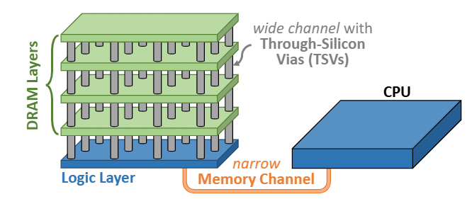

# Overall Idea: DSE for Vertically-stacked Compute-Memory Fabrics

## CMOS 2.0

:::{.columns}
:::{.column width="50%"}
- End of area scaling causes 3D stacking.
- CMOS 2.0 is IMEC's term for its 3D stacking enabled by hybrid bonding interfaces different process layers.
- Specifically, eDRAM process on top of regular process is possible.
- Having high bandwidth connections between eDRAM above and compute below would allow close to ideal compute-memory fabrics.
:::
:::{.column width="50%"}

:::
:::

## Main Problem

CMOS 2.0-based 3D stacking capabilities need to be accounted for by the existing DSE frameworks. 

New problem dimensions:

- Adding Multicore NoC-type NMC accelerators in the modelling space
- Overall architectural arrangements of such 3D-stacked chips
- Much denser integration introduces special temperature-related constraints which affects each memory technology differently


## Build on ZigZag

Plan: Extend ZigZag to account for [NoC-style compute-memory fabrics]{.color-emph}.  

Relevant extensions:  

- **ZigZag-LLM** - we target LLM acceleration and GNNs^[There is no particular extension for GNNs yet. Treat as usual OR extend ourselves.]
- **MARP + Stream** - multicore compute-memory fabric efficiency 
- **ZigZag-IMC** - account for special dataflows available in IMC

> *I've found that it might be better to treat ZigZag as "core" for latter extensions, like MICAS is doing now.* 

## ZigZag - Current State

Looking into ZigZag, the project's direction seems to be:

- Mei^[Graduated] - Original cost estimation + DSE
- Sun - IMC extensions (ZigZag-IMC)
- Symons - Main repo maintainer, Stream
- Geens - LLM-specific DSE (ZigZag-LLM)

# Specifics: DRAM NoC Example

## Near-Memory Compute with Buffer Memory Above

:::: {.columns}

::: {.column width=0.47}
We can utilize NoC-based accelerator architectures^[e.g. Eyeriss2, NeuRRAM, NeuroSIM ] as effective architectures on 3D compute-memory fabrics. They:

- Place compute near large global buffers in a scalable architecture
- Come with mapping algorithms

> *Challenge: Make these compatible with ZigZag* 

:::

:::: {.column width=0.47 layout="[[-1], [1], [-1]]"}


{fig-align="center"}^[Mutlu, Onur, et al. "A modern primer on processing in memory." Emerging computing: from devices to systems: looking beyond Moore and Von Neumann. Singapore: Springer Nature Singapore, 2022. 171-243.]

::::

::::

## DRAM: Explicit Refresh

With explicitly managed memory, we explicitly know when we're not using the DRAM. 

Refreshes typically distributed evenly over all time, $t_r\approx 64ms$ but you stall DRAM requests every $64ms/depth$ ($\sim \mu s$).

It takes about $~400n*8192=3.2ms$ for a full refresh for all rows at once. 

**Goal: interlace the DRAM refresh with the workload scheduling.**

> *Challenge: explicitly control refresh durations as a scheduling constraint in ZigZag.*

## DRAM: Dark Silicon
DRAM refresh requirement vs temp. can be modelled via Arrhenius model (energy barrier)^[May require probabilistic modelling later on.]
$$t_{ret}(T)=t_{ret}(T_0)\cdot e^{\frac{E_a}{k_B}(1/T-1/T_0)}$$
We find that the $t_r\propto e^{-T}$ and so **heating makes refresh cycle constraints more frequent**^[in the first place, do DNNs care so much about the errors?]

The problem is exarcerbated in 3D stacking which traps heat.

> *Challenge: Account for temperature in workload scheduling*

## Electrothermal-Hardware-Algo Co-design

:::: {.columns}

::: {.column width=0.47}

Classical co-design models latency and energy vs workload.

If we eliminate the memory wall, we may be **bottlenecked by the thermal power budget**.

1. Must characterize accelerator's heating effect and schedule power gating/core usage accordingly.
2. Thermal simulations model constraints in the loop.  

:::

::: {.column width=0.47}

```{mermaid}
%%| fig-width: 50%
%%| fig-align: center
%%| fig-post: H
%%| font-size: 24pt
%%| mermaid-format: svg
flowchart TD
	classDef default line-height:1.5;
	
	A["Compact 
	thermal 
	simulation"] -->|"refresh 
	constraint"| B["Refine  
	Scheduling and 
	Mapping"] --> C["PrimeTime 
	Power 
	Estimates"] --> A
```

:::

:::: 

## Electrothermal-Hardware-Algo Co-design (2)

Coarse-grid modelling of the thermal stack from a top-level floorplan with a heat-coupling equation
$$\mathbf{C} \frac{d\mathbf{T}}{dt} = -\mathbf{G}\mathbf{T} + \mathbf{P}$$
Problem: Needs a preliminary top-level floorplan to discretize.

Each block has a specific thermal characteristic (from PrimeTime power estimates).


## Timeline


```{mermaid}
%%| mermaid-format: svg
%%| font-size: 24pt
%%{init: {  
'theme': 'dark',  
'timeline': {  
'fontSize': '24pt'  
}  
}}%%
timeline
	Y1: NMC-NoC (CMF) Architectures Modelling, Survey.
	  : ZigZag Cost-Model work with CMOS2.0 memory stacks characterization.
	Y2: Complete CMF cost-model extensions to ZigZag.
	  : CMF tile scalable RTL
	Y3: CMF tile tapeout.
	  : Validate - Cost-Model, Workloads, Thermal Characteristics
	Y4: CMF tile-based NoC accelerator tapeout.  
	  : Validate - Cost-Model, Workloads, Thermal Characteristics
```
 

## Timeline (2)


```{mermaid}

%%| mermaid-format: svg

%%{init: {  
'gantt': {
    'fontSize': '12',
    'useWidth': '800'
}  
}}%%
gantt
    title CMF / NMC-NoC Research & Tapeout Roadmap
    dateFormat  YYYY
    axisFormat %m-%Y

    section Research Foundations
    NMC-NoC + CMF architecture survey        :a1, 2027, 6M
    CMOS2.0 memory characterization for analytical modelling:a2, after b1, 6M
    Initial CMF architectures                :a3, after a1, 6M

    section ZigZag: DSE & Estimator
    Extend ZigZag with CMF cost model        :crit, b1, 2027, 1y
    Validation vs existing CMF architectures :b2, after a2, 6M
    Validation vs CMOS2.0 memories           :b3, after a2, 6M

    section Silicon
    DSE CMF Tile Architecture             :crit,c1, after a3, 1y
    Tapeout 1 (CMF Tile)                                :c2, after c1, 1y
    DSE CMF Array Architecture                :crit, c4, after c1, 1y
    Tapeout 2 (CMF Array)                               :c3, after c2, 1y
    
```

# Preliminary Characterization

- Based off typical 3D DRAM fabrics and their communication interfaces
- Use Ramulator?


## Onur Mutlu Stack

SAFARI group has had decades of work on DRAM-based IMC

- Focuses on accelerating `memset` and `memcpy`^[They argue these comprise a lot of the typical workload]
- General workload acceleration (not DNN targeted)  