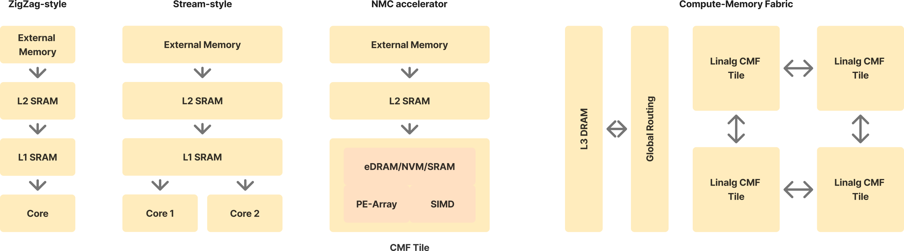
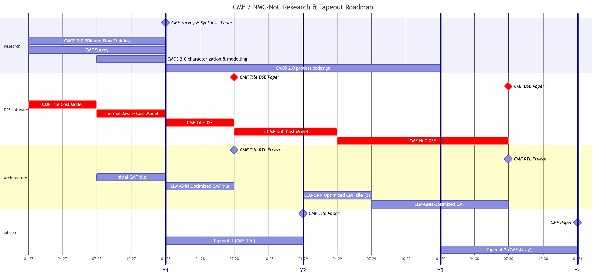
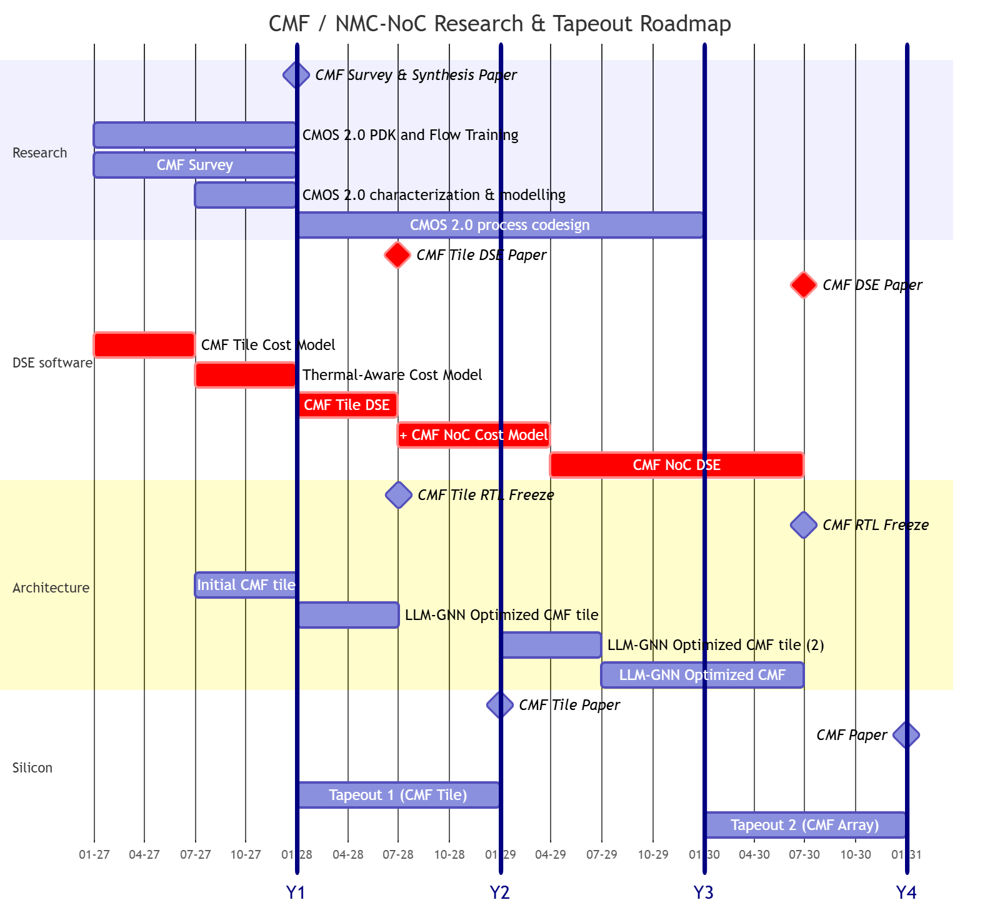
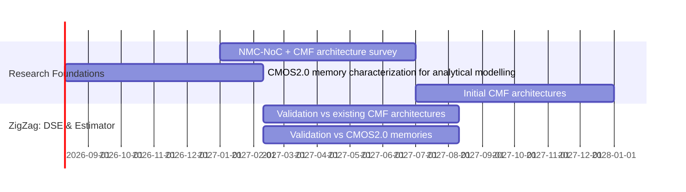
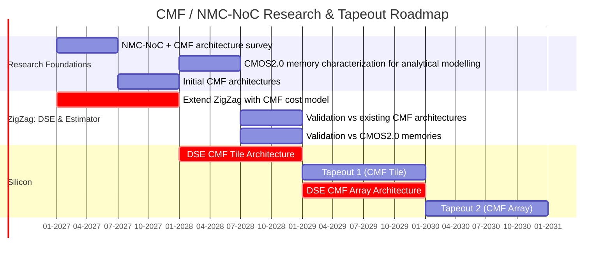
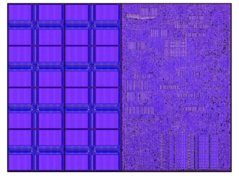
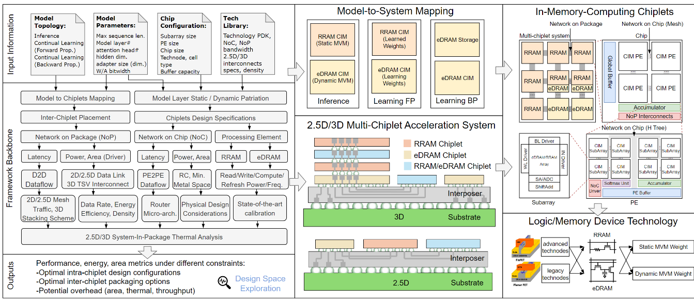

# For the meeting/ ideas for the proposal.

## Questions: On Proposal

::: {.incremental .fade-in-then-semi-out}
- What's the scope of the proposal? (A new project or just one PhD?)
- What is the timeline for the proposal?
- What's the approval process for the proposal?
- What are my deliverables for this proposal?
- How much freedom do we have to shape the goals of the project?
:::
 
## Questions: On Environment 

::: {.incremental .fade-in-then-semi-out}
- Difference between a MICAS PhD and an IMEC PhD?
- Do I have to pass the standard application process under IMEC?
- How would IP & NDAs work against the publishing goals?

- Likely co-supervisor? Daily supervisor? Advising hierarchy?
- Will I be working with other PhD students/IMEC teams doing specific parts of the stack?
- Master's students? TA-ship?
:::


## Ideas for the proposal {.auto-fragment-slide}

My dreams: 

[AI should be entirely self-contained in its hardware]{.bigger .color-emph}

- Only training and inference inputs/outputs should be coming in and out of the chip.
- AI can be trained entirely in-place- "AI lives in this chip"
- *Algorithm should be co-designed for the specific special memory type, not work around it.*
 
Circuits Journals, Design Automation Journals, + [A Nature paper]{.color-emph} - demonstrating impact not just on metrics but on fundamental methodology and full-stack insights.

## From ZigZag-style Accelerators to CMF


 
> [!note]
> Most practical accelerators are Stream-style or ZigZag-style.
> 
> A lot of academic demonstrations of IMC/NMC fit in the third style.
> 
> NoC-style accelerators like WSE exist as samples of (4).

## Problem Dimensions {style="font-size: 20pt;"}

::: {.incremental .fade-in-then-semi-out} 

- **CMOS 2.0**. Do CMF accelerators in IMEC CMOS 2.0 have different properties than existing literature? 
- **Towards DSE**. DSE and analytical modelling of needs the recognition of a regular modellable architecture of CMFs.
- **Thermal Problem of 3D stacks**. Thermal limits are lowered by 3D integration but approached closer by high memory bandwidth. We also need to add this to the modelling and simulation. 
- **Heterogenous Computational Memory.** 3D integration allows many types of memory which are not all accounted for by CACTI and ZigZag. We need to develop special constraints to take care of the needs of the different memory types. Additionally, memory and processing can be the same exact thing.
- **Special Memory Management.** Special techniques for memory management and bandwidth maximization exist for 3D memories. Existence/absence thereof must be accounted for in the modelling.^[Donghyuk '16 ACM TACO "Simultaneous multi-layer access"]
:::

---  



# Specifics and Implementation

## Potential DSE/Modelling Framework {.smaller}

Idea: borrow the best from [ZigZag and CiMLoop]{.color-emph style="font-size=30pt;"}. Then extend frameworks for 3D integration and NoC-style accelerators:

:::: {.columns}

::: {.column width=0.47}
 
Requirements:

 - [ ] NoC-style dataflow topologies (mesh, torus, etc.)
 - [ ] Flexibility and generality (on the level of ZigZag or Timeloop, not ad-hoc)
 - [ ] Modelling of heterogenous regular or computational memory types 
 - [ ] Thermal modelling

:::

::: {.column width=0.47}

Insights: 

- Loop ordering is most powerful for hierarchical memory (i.e. inside the CMF Tile).
- Borrow ZigZag-IMC or CiMLoop's IMC dataflow models + with fast statistical estimation to help with the larger mapspace.^[Preliminary: It feels like CiMLoop accounts for more than ZigZag-IMC.]
- Graph techniques^[Shah 2023 Irregular Dataflow Graphs, AIHwKitLightning, MARP] likely effective when considering entire models.
- Stream already accounts for multicore mesh topologies.

:::

::::


## ZigZag vs CiMLoop-

- ZigZag beats TimeLoop + Accelergy by accounting for **uneven loop blocking**.
	- This is important to account for in a scheme where memory isn't hierarchical.
- CimLoop has cell-level granularity for mapping and seems to have . ZigZag-IMC has a matrix-level granularity, treats the IMC as a special PE-array that can map multiple spatial loops.

## Building on ZigZag

Plan: Extend ZigZag to account for [NoC-style compute-memory fabrics]{.color-emph}.  

Relevant extensions:  

- **ZigZag-LLM** - we target LLM acceleration and GNNs^[There is no particular extension for GNNs yet. Treat as usual OR extend ourselves.]
- **MARP + Stream** - multicore compute-memory fabric efficiency 
- **ZigZag-IMC** - account for special dataflows available in IMC for ZigZag^[CiMLoop's model seems more complete to me.]

> *I've found that it might be better to treat ZigZag as "core" for latter extensions, like MICAS is doing now.* 

## Building on CIMLoop

CiMLoop
- Built off Timeloop + Accelergy
- Uses statistical distributions for workload modelling estimates.
- Rich YAML-based representation of IMC data flows.

> *Need to do a comprehensive comparison of ZigZag-IMC vs CIMLoop in the code level.*

## ZigZag - Current State

Looking into ZigZag, the project's direction seems to be:

- Mei^[Graduated] - Original cost estimation + DSE
- Sun - IMC extensions (ZigZag-IMC)
- Symons - Main repo maintainer, Stream
- Geens - LLM-specific DSE (ZigZag-LLM)

## Path to self-contained Training and Inference

Goal: [Avoid off-chip data movement completely]{.color-emph} 

:::: {.columns}

::: {.column width=.47}

| LLM         | INT8   | INT4  |
| ----------- | ------ | ----- |
| Deepseek v3 | 156G   | 78G   |
| Llama-2     | 17.5G  | 8.75G |
| Mistral 7   | 1.825G | 0.9G  |

Would be nice to be able to demonstrate the SLMs in a fully self-contained demonstration^[Cerebras WSE-3 already does this, but 2D-stacked leading to a massive chip.]
^[[Barriers to Monolithic LLM inference](../../../03_Concepts/Barriers%20to%20Monolithic%20LLM%20inference.md)] on CMOS 2.0

:::

::: {.column width=.47}

Practical enablers:

- **MARP** - increases spatial utilization
- **5PP**^[Dazzi, Martino, et al. "5 parallel prism: A topology for pipelined implementations of convolutional neural networks using computational memory." _arXiv preprint arXiv:1906.03474_ (2019).] - Practically, weight movement between "cores" (tiles) was only needed in 5 neighboring tiles for CNNs. How about nowadays?

:::

::::

## Near-Memory Compute with Buffer Memory Above

:::: {.columns}

::: {.column width=0.47}
We can utilize NoC-based accelerator architectures^[e.g. Eyeriss2, NeuRRAM, NeuroSIM ] as effective architectures on 3D compute-memory fabrics. They:

- Place compute near large global buffers in a scalable architecture
- Come with mapping algorithms

:::

:::: {.column width=0.47 layout="[[-1], [1], [-1]]"}


{fig-align="center"}^[Mutlu, Onur, et al. "A modern primer on processing in memory." Emerging computing: from devices to systems: looking beyond Moore and Von Neumann. Singapore: Springer Nature Singapore, 2022. 171-243.]

::::

::::

## DRAM: Explicit Refresh

With explicitly managed memory, we explicitly know when we're not using the DRAM.  

Refreshes typically distributed evenly over all time, $t_r\approx 64ms$ but you stall DRAM requests every $64ms/depth$ ($\sim \mu s$).

It takes about $~400n*8192=3.2ms$ for a full refresh for all rows at once. 

**Goal: interlace the DRAM refresh with the workload scheduling.**

> *Challenge: explicitly control refresh durations as a scheduling constraint in ZigZag.*

## DRAM: Dark Silicon
DRAM refresh requirement vs temp. can be modelled via Arrhenius model (energy barrier)^[May require probabilistic modelling later on.]
$$t_{ret}(T)=t_{ret}(T_0)\cdot e^{\frac{E_a}{k_B}(1/T-1/T_0)}$$
We find that the $t_r\propto e^{-T}$ and so **heating makes refresh cycle constraints more frequent**^[in the first place, do DNNs care so much about the errors?]

The problem is exarcerbated in 3D stacking which traps heat.

> *Challenge: Account for temperature in workload scheduling*

## Electrothermal-Hardware-Algo Co-design

:::: {.columns}

::: {.column width=0.47}

Classical co-design models latency and energy vs workload.

If we eliminate the memory wall, we may be **bottlenecked by the thermal power budget**.

1. Must characterize accelerator's heating effect and schedule power gating/core usage accordingly.
2. Thermal simulations model constraints in the loop.  

:::

::: {.column width=0.47}

```{mermaid}
%%| fig-width: 50%
%%| fig-align: center
%%| fig-post: H
%%| font-size: 24pt
%%| mermaid-format: svg
flowchart TD
	classDef default line-height:1.5;
	
	A["Compact 
	thermal 
	simulation"] -->|"refresh 
	constraint"| B["Refine  
	Scheduling and 
	Mapping"] --> C["PrimeTime 
	Power 
	Estimates"] --> A
```

:::

:::: 

## Electrothermal-Hardware-Algo Co-design (2) {.unlisted} 

Coarse-grid modelling of the thermal stack from a top-level floorplan with a heat-coupling equation
$$\mathbf{C} \frac{d\mathbf{T}}{dt} = -\mathbf{G}\mathbf{T} + \mathbf{P}$$
Problem: Needs a preliminary top-level floorplan to discretize. 

Each block has a specific thermal characteristic (from PrimeTime power estimates).


## Timeline  



## Timeline (2) 




## Timeline (3) {.unlisted}




# Preliminary Characterization {.unlisted}

- Based off typical 3D DRAM fabrics and their communication interfaces
- Use Ramulator?


## Onur Mutlu Stack

SAFARI group has had decades of work on DRAM-based IMC

- Focuses on accelerating `memset` and `memcpy`^[They argue these comprise a lot of the typical workload]
- General workload acceleration (not DNN targeted)  

# Appendix {.unlisted}

## Applicability of ZigZag

ZigZag finds its data reuse capability from maximizing temporal reuse and utilization.
However, in a fully self-contained CMF, _there is no weight movement_.

How about activation movement?

To solve activation movement, we take inspiration from 5PP and mesh-style data movement. This is different from ZigZag's hierarchical transferred data movement (because it, in fact, is strictly single core).
Stream's multicore data reuse **assumes that a specific memory level is shared between cores.** 
I doubt this can be the case _across tiles_.
 
## Demonstrations of Integrated CIM-inference

- Cerebras WSE3 - Full-wafer divided into reticle-limit chips.
- Corsair^[Srivastava, Satyam, et al. "Corsair: An In-memory Computing Chiplet Architecture for Inference-time Compute Acceleration." IEEE Micro (2025).] - d-Matrix (company) in IEEE Micro Magazine
- 3D-CiMLet^[Du, Shuting, et al. "3d-cimlet: A chiplet co-design framework for heterogeneous in-memory acceleration of edge llm inference and continual learning." 2025 62nd ACM/IEEE Design Automation Conference (DAC). IEEE, 2025.] - Design-space exploration work by Purdue on 3D integration CiM with different memory types.

:::: {.columns}

::: {.column}

^[Cerebras WSE3 White Paper]

:::

::: {.column}

^[3D-CiMLET, Purdue]

:::

::::

## Demonstrations of Integrated CIM-inference (2) {.unlisted}

Things to look out for
1. Data Routing Techniques
2. Core Arrangement
3. Thermal Considerations
4. 3D integration style/level

## CMOS 2.0

:::{.columns}
:::{.column width="50%"}
- End of area scaling causes 3D stacking.
- CMOS 2.0 is IMEC's term for its 3D stacking enabled by hybrid bonding interfaces different process layers.
- Specifically, eDRAM process on top of regular process is possible.
- Having high bandwidth connections between eDRAM above and compute below would allow close to ideal compute-memory fabrics.
:::
:::{.column width="50%"}

:::
:::